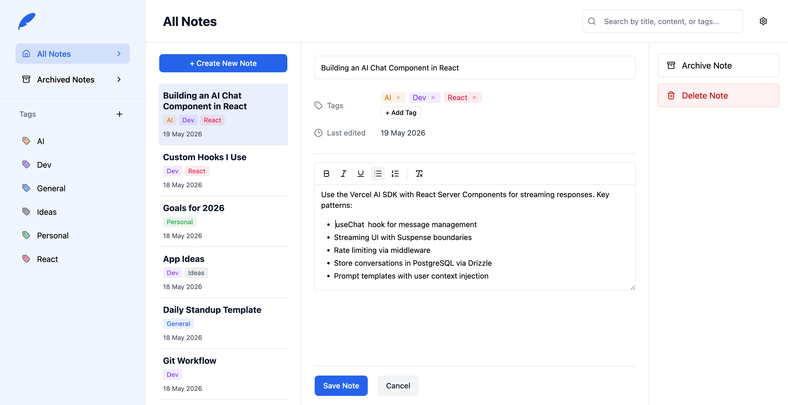

# Inky

A responsive note-taking app built with Vite, React, and TypeScript. Create notes, format their
content, organize them with colored tags, archive older notes, and customize the interface theme and
font style.

[https://farzanuddin.github.io/inky](https://farzanuddin.github.io/inky/)



## Objective

The goal of this project was to build a polished notes application with a desktop-first layout The app explores persistent client-side state, a
keyboard-friendly UI built with **shadcn/Base UI primitives**, a custom theming system, tag-based
organization, and a lightweight **WYSIWYG editor** for writing formatted notes.

## Features

- **Create, read, update, and delete notes** — manage notes from a responsive editor with validation
  for required titles
- **Rich text editing** — format note bodies with bold, italic, underline, bulleted lists, numbered
  lists, and clear formatting controls
- **Archive workflow** — move notes into an archived view without permanently deleting them
- **Tag organization** — add, delete, filter by, and assign colored tags to notes
- **Scoped search** — search by title, content, and tag while staying scoped to either All Notes or
  Archived Notes

## Tech Stack

| Technology                                    | Version | Role                        |
| --------------------------------------------- | :-----: | --------------------------- |
| [React](https://react.dev/)                   | ^19.2.6 | UI framework                |
| [TypeScript](https://www.typescriptlang.org/) | ~6.0.2  | Static typing               |
| [Vite](https://vite.dev/)                     | ^8.0.12 | Build tool & dev server     |
| [Tailwind CSS v4](https://tailwindcss.com/)   | ^4.3.0  | Utility-first CSS framework |
| [shadcn](https://ui.shadcn.com/)              | ^4.7.0  | UI component scaffolding    |
| [date-fns](https://date-fns.org/)             | ^4.1.0  | Date formatting             |
| [Vitest](https://vitest.dev/)                 | ^4.1.6  | Test runner                 |

## Data Storage Limitation

Inky stores data in the browser's `localStorage`, so notes are local to the current browser and
device. Clearing browser site data, switching browsers, or opening the app on another device will not
sync existing notes. There is no backend, account system, or cloud sync yet.

## Getting Started

1. Install dependencies:

   ```bash
   npm install
   ```

2. Start the dev server:

   ```bash
   npm run dev
   ```
